# IT Help Desk Ticket Management System — Azure Edition

This project is an upgraded version of my original Help Desk Ticket Management System, where I migrated the backend from a local PostgreSQL database to a cloud-based solution using Microsoft Azure SQL Database.

The goal of this upgrade was to move beyond a local setup and build a system that reflects how real-world backend applications interact with cloud infrastructure.

---

## Project Overview

This is a Java-based command-line application that simulates an internal IT Help Desk system.

It allows users to:

* create and manage tickets
* assign tickets to technicians
* update ticket status
* track ticket history
* query structured data using SQL joins

In this version, all data is stored in Azure SQL Database, and the Java application connects to it using JDBC.

---

## Key Features

* Full CRUD operations on tickets
* Technician assignment workflow
* Ticket status management (open, in_progress, closed)
* Ticket update history tracking
* Input validation for users and categories
* SQL queries using joins across multiple tables

---

## System Architecture

Java Application (DAO Pattern)
⬇
JDBC Connection
⬇
Azure SQL Database

This design separates business logic from database operations, making the system modular and scalable.

---

## Entity Relationship Diagram

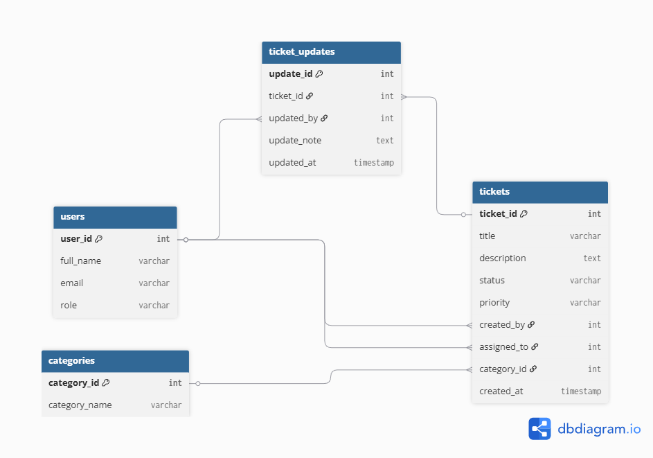

This diagram represents the relational structure of the system.

Key relationships:

* One user can create multiple tickets
* A technician (user) can be assigned multiple tickets
* Each ticket belongs to one category
* Each ticket can have multiple updates (history tracking)

---

## Database Design

The system uses a relational schema with the following tables:

* users → employees, technicians, admins
* categories → issue types
* tickets → main ticket records
* ticket_updates → history/logs for each ticket

The schema includes:

* Primary and foreign keys
* Check constraints for validation
* Relationships between entities

---

## Azure Setup and Configuration

### Azure SQL Database Creation

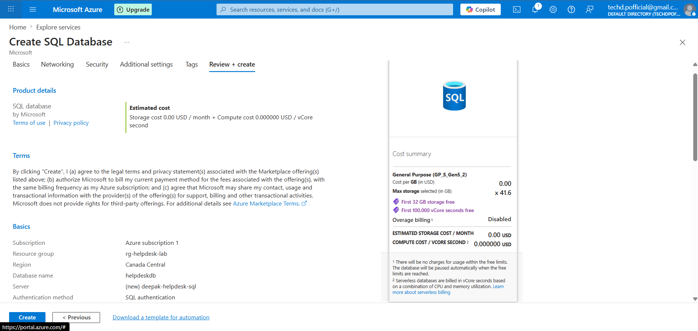

---

### Database Overview

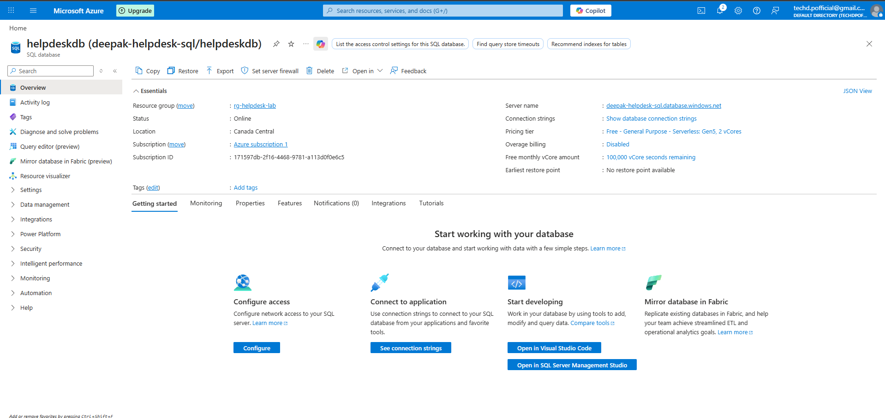

---

### Firewall Configuration (Client Access)

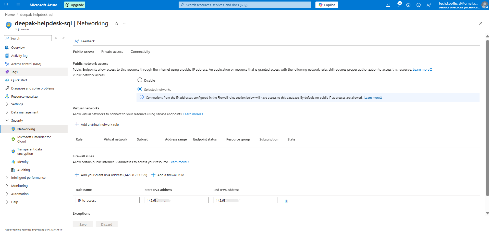

---

### Database Connection via SSMS

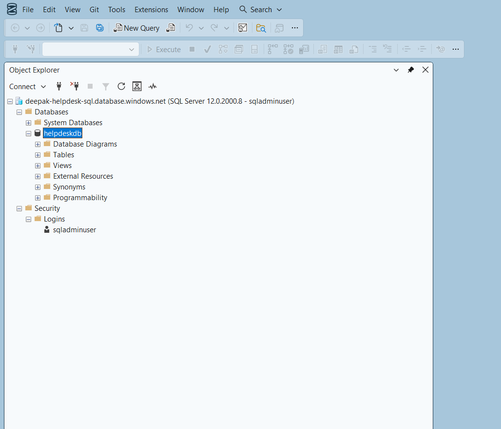

---

## Database Setup and Data

### Schema Creation

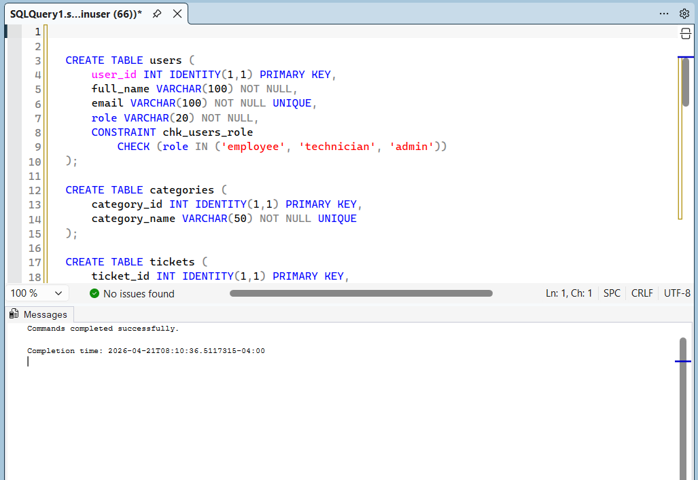

---

### Seed Data Insertion

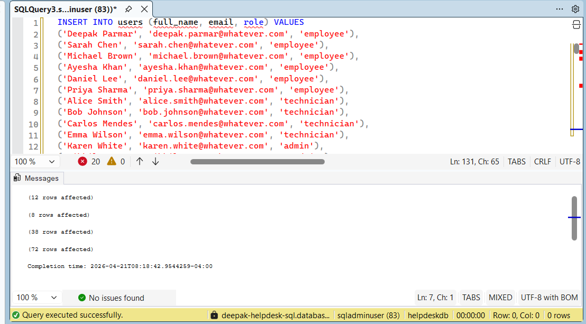

---

### Data Validation (Record Counts)

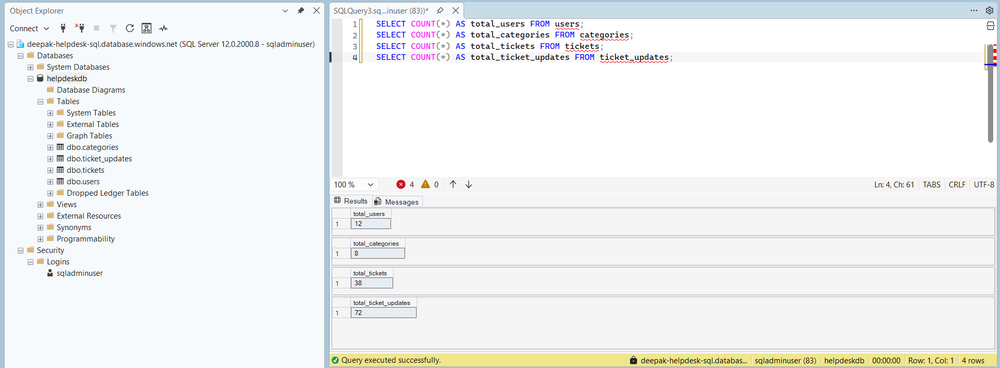

---

### Ticket Query (Joins Across Tables)

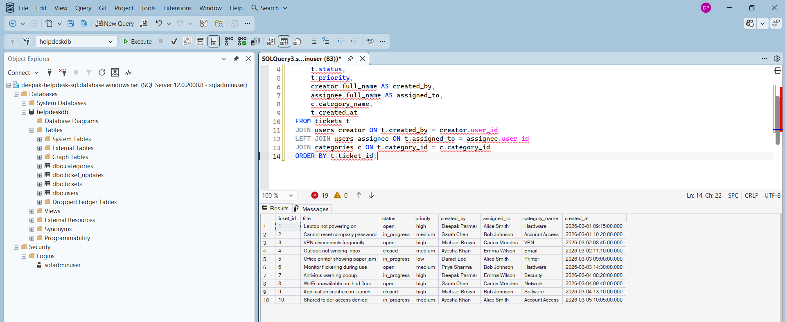

---

### Ticket Update History

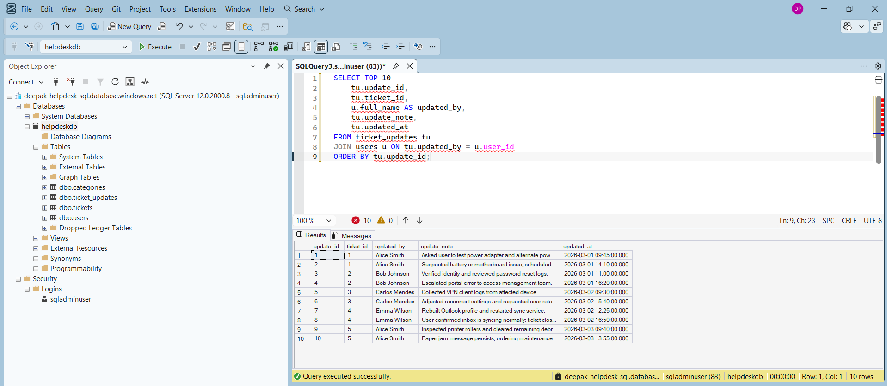

---

## Java Integration (JDBC and Azure)

### SQL Server JDBC Driver Setup

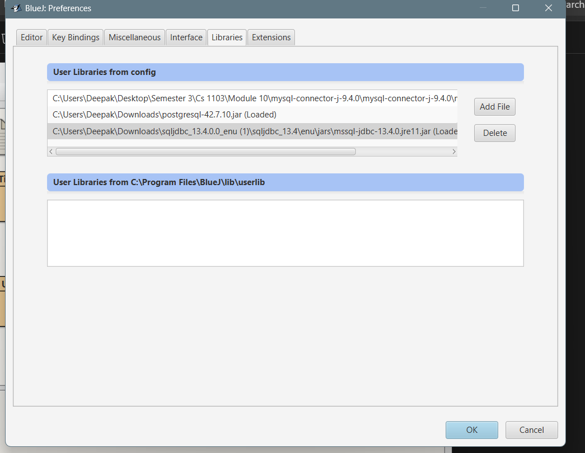

---

### Successful Connection to Azure SQL

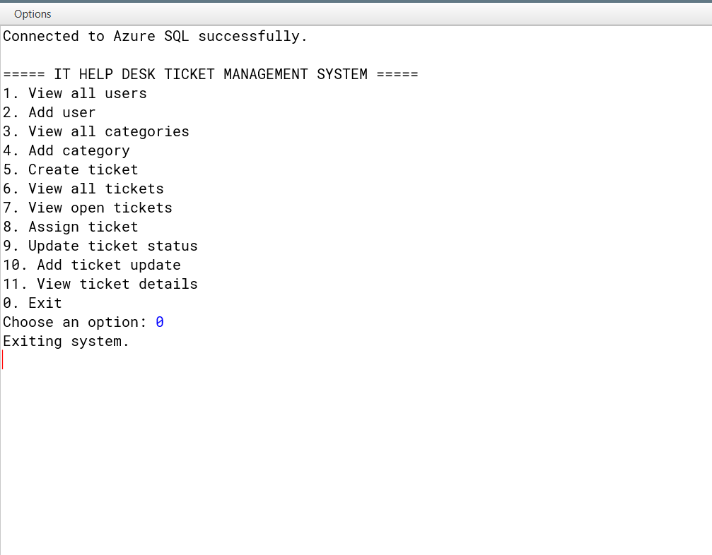

---

## Application Functionality

### View Users

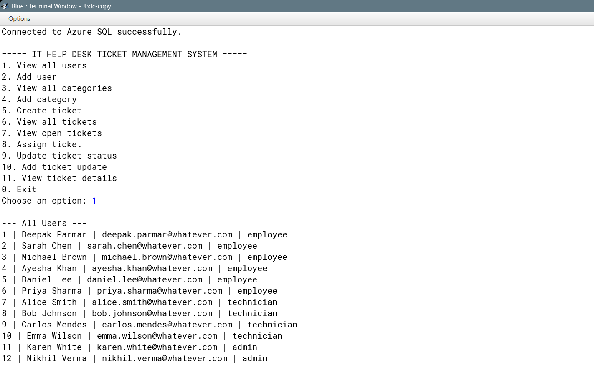

---

### View Categories

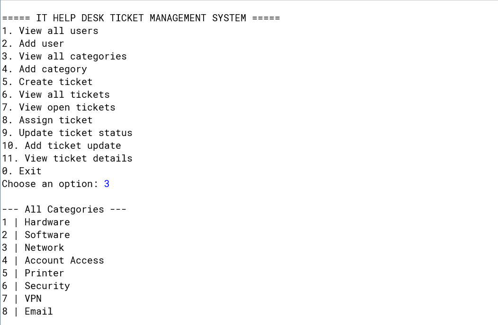

---

### View All Tickets

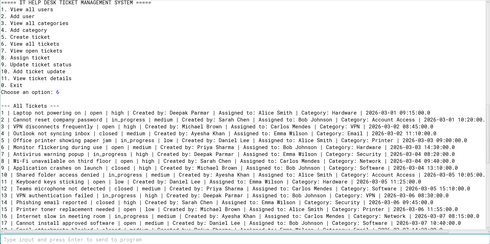

---

### View Ticket Details and History

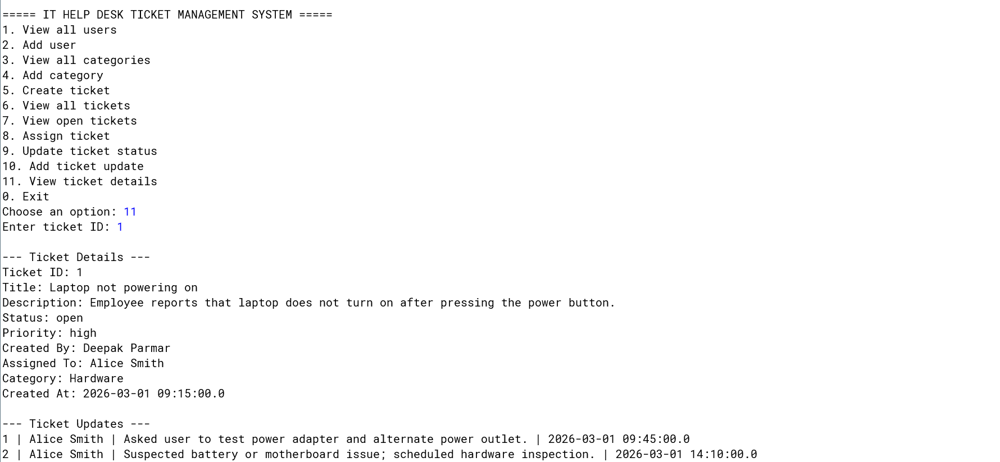

---

### Add Ticket Update

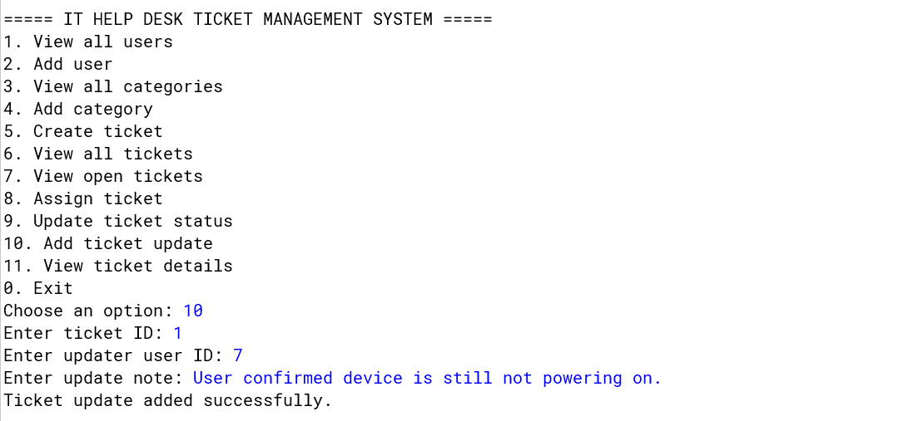

---

### Update Ticket Status

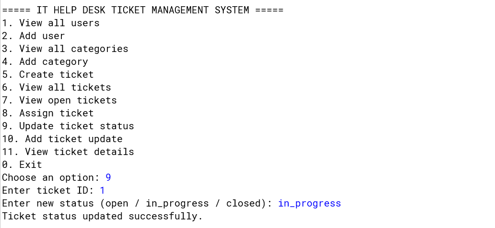

---

## Azure Monitoring (Live Activity)

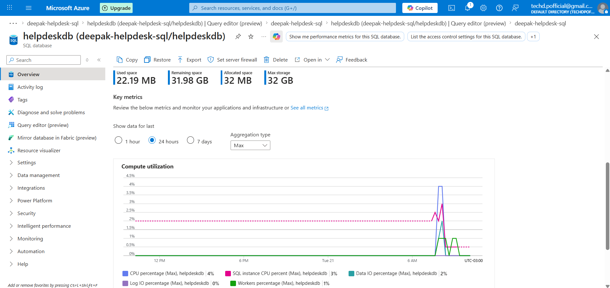

This shows real-time CPU and I/O activity in Azure SQL Database, generated by the Java application performing operations such as ticket creation, updates, and queries.

---

## How to Run

1. Clone the repository
2. Open the project in BlueJ or any Java IDE
3. Add the Microsoft SQL Server JDBC driver to the project libraries
4. Update credentials in `DatabaseConnection.java`
5. Run `Main.java`

---

## Important Notes

* The JDBC driver must be added manually
* Replace placeholder credentials before running
* Do not commit real database credentials

---

## What This Project Demonstrates

* Java backend development using DAO pattern
* Relational database design and SQL querying
* Cloud database integration using Azure SQL
* JDBC connectivity and troubleshooting
* Real-world IT support workflows

---

## Future Improvements

* Add GUI (JavaFX or web interface)
* Implement authentication and user roles
* Expose REST API endpoints
* Deploy as a full cloud-hosted application

---

## Conclusion

This project reflects my approach to learning by building real systems.
By extending a local application into a cloud-based solution, I gained practical experience in backend development, database design, and Azure cloud integration.

---
